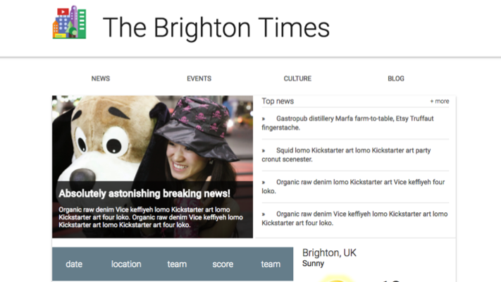

# The Brighton Times Website
> Responsive news website for Brighton.

[![NPM Version][npm-image]][npm-url]
[![Build Status][travis-image]][travis-url]
[![Downloads Stats][npm-downloads]][npm-url]

News site for the city of Brighton.  Includes weather, sports, local news, and national news.



## Installation

OS X, Linux and Windows:

```sh
git clone git@github.com:Danny-G-Smith/TheBrightonTimes.git
```

## Development setup

There is no database or dependencies, after you have installed it, you are good to go.


## Release History

* 3.0.0
    * Phase 3 responsive, feature complete
* 2.0.0
    * Phase 2, a work in progress
* 1.0.0
    * Phase 1, basic site

    * Work in progress

## Meta

Your Name – Danny G Smith

Distributed under the XYZ license. See ``LICENSE`` for more information.

[https://github.com/yourname/github-link](https://github.com/dbader/)

## Contributing

Nope.

<!-- Markdown link & img dfn's -->
[npm-image]: https://img.shields.io/npm/v/datadog-metrics.svg?style=flat-square
[npm-url]: https://npmjs.org/package/datadog-metrics
[npm-downloads]: https://img.shields.io/npm/dm/datadog-metrics.svg?style=flat-square
[travis-image]: https://img.shields.io/travis/dbader/node-datadog-metrics/master.svg?style=flat-square
[travis-url]: https://travis-ci.org/dbader/node-datadog-metrics
[wiki]: https://github.com/yourname/yourproject/wiki
